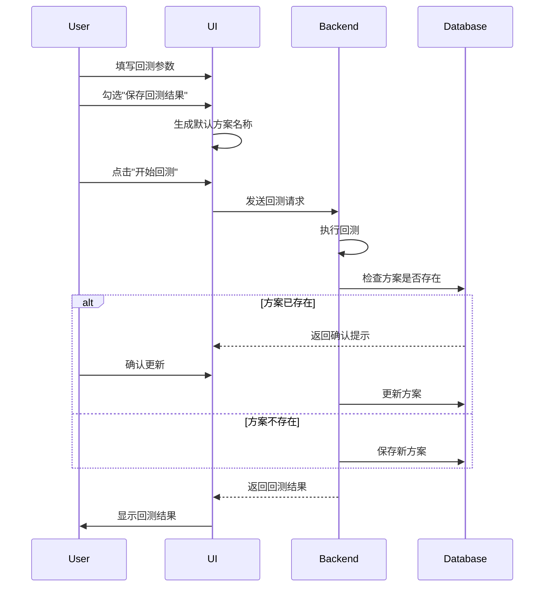

# 期权策略回测系统 - 方案管理设计文档

## 1. 方案命名规则

### 默认命名格式
```
{etf_code}_{delta_list}_{start_date}_{end_date}
```

### 命名规则说明
- etf_code: ETF代码（如510050）
- delta_list: Delta值列表，用逗号分隔
- start_date: 开始日期（格式：YYYYMMDD）
- end_date: 结束日期（格式：YYYYMMDD）

## 2. UI交互设计

### 2.1 参数输入区域
- 在回测参数表单底部添加：
  - [ ] 保存回测结果（复选框）
  - 默认不选中
  - 选中时显示方案名称输入框（预填充默认命名）

### 2.2 回测流程
1. **参数填写**
   - 用户填写回测参数
   - 选择是否保存回测结果

2. **执行回测**
   - 点击"开始回测"按钮
   - 如果选择保存结果：
     - 检查方案名称是否已存在
     - 若存在：弹窗提示是否更新
     - 若不存在：直接保存

3. **结果保存**
   - 保存内容：后端返回的完整JSON结果
   - 保存位置：专用数据库
   - 保存时间：回测完成后立即保存

### 2.3 方案管理面板

#### 入口
- 页面右上角添加"方案管理"按钮
- 点击弹出模态框

#### 模态框内容
1. **方案列表**
   - 表格形式展示
   - 列表项包含：
     - 方案名称
     - 创建时间
     - 最后修改时间
     - 操作按钮

2. **操作功能**
   - 加载：使用该方案参数重新填充表单
   - 删除：删除该方案及其结果
   - 重命名：修改方案名称

## 3. 数据结构

### 3.1 方案数据表
```sql
CREATE TABLE backtest_schemes (
    id INTEGER PRIMARY KEY,
    name VARCHAR(100) NOT NULL UNIQUE,
    params TEXT NOT NULL,  -- JSON格式存储参数
    results TEXT NOT NULL, -- JSON格式存储结果
    created_at TIMESTAMP NOT NULL,
    updated_at TIMESTAMP NOT NULL
);
```

### 3.2 参数JSON结构
```json
{
    "etf_code": "510050",
    "delta_list": [-0.3, -0.2],
    "start_date": "20230101",
    "end_date": "20231231",
    "other_params": {}
}
```

## 4. 交互流程图



## 5. 错误处理

### 5.1 方案命名冲突
- 提示信息：`方案"{name}"已存在，是否更新？`
- 选项：
  - 更新现有方案
  - 取消保存
  - 使用新名称

### 5.2 数据验证
- 方案名称：仅允许字母、数字、下划线和连字符
- 参数完整性：保存前检查必要参数是否完整
- 结果有效性：验证回测结果的完整性和有效性

## 6. 注意事项

1. **数据库性能**
   - 考虑结果数据量较大，需要合理设计存储策略
   - 可能需要定期清理过期数据

2. **用户体验**
   - 保存操作不应影响回测的主流程
   - 提供清晰的反馈信息

3. **安全性**
   - 防止SQL注入
   - 参数和结果的合法性验证

4. **可扩展性**
   - 预留参数扩展空间
   - 考虑未来可能的功能增强