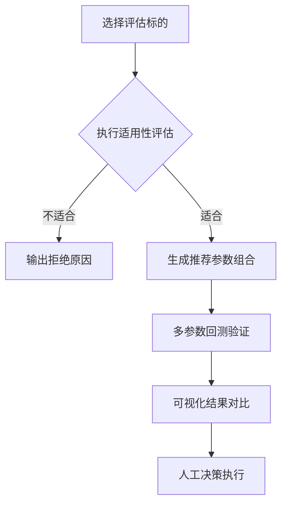
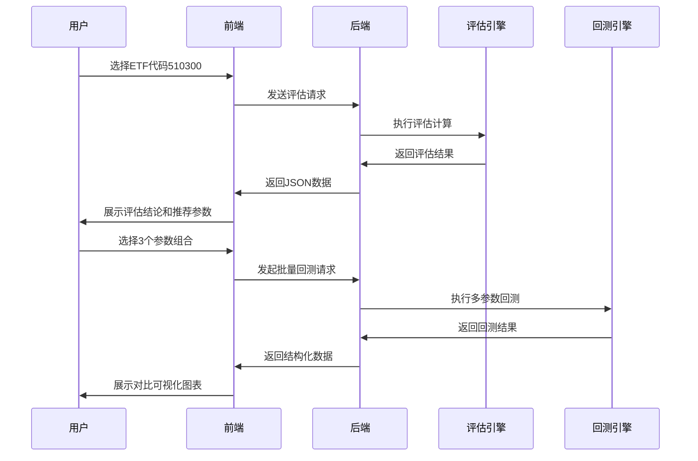

# ETF网格交易评估系统设计文档

## 一、系统整体执行流程


## 二、核心功能模块设计

### 1. 标的评估模块
#### 输入要素：
- ETF代码/名称
- 评估时间范围（默认近3年）
- 基准比较指数（可选）

#### 评估输出：
```json
{
  "suitability": {
    "score": 82,
    "grade": "A",
    "risk_level": "中风险",
    "indicators": {
      "volatility": 0.38,
      "adx": 18.5,
      "bband_ratio": 0.85,
      "atr_ratio": 0.04
    }
  },
  "parameter_candidates": [
    {
      "id": "config1",
      "grid_space": 1.2,
      "price_range": [28.5, 32.8],
      "grid_count": 15,
      "stop_loss": 27.9,
      "take_profit": 33.5
    },
    {
      "id": "config2",
      "grid_space": 1.5, 
      "price_range": [27.8, 33.2],
      "grid_count": 12,
      "stop_loss": 27.0,
      "take_profit": 34.0
    }
  ]
}
```

### 2. 参数生成逻辑
```python
def generate_parameters(analysis_data):
    # 基于波动率确定网格密度
    volatility = analysis_data['volatility']
    grid_space = np.clip(volatility*0.6, 0.8, 2.0)
    
    # 根据ATR确定价格区间
    atr = analysis_data['ATR']
    current_price = analysis_data['close'][-1]
    price_range = [
        round(current_price - 3*atr, 2),
        round(current_price + 3*atr, 2)
    ]
    
    # 生成3种风险偏好的参数组合
    return [
        conservative_config(grid_space, price_range),
        balanced_config(grid_space, price_range),
        aggressive_config(grid_space, price_range)
    ]
```

### 3. 回测验证模块
#### 验证维度：
| 维度         | 验证指标                   | 可视化方式          |
|--------------|---------------------------|---------------------|
| 收益表现     | 年化收益率、累计收益       | 净值曲线对比图      |
| 风险控制     | 最大回撤、波动率           | 回撤曲线图          |
| 交易质量     | 胜率、盈亏比               | 交易分布热力图      |
| 参数稳健性   | 参数敏感性分析             | 三维曲面图          |

#### 回测结果示例：
```python
{
  "config1": {
    "annual_return": 18.5,
    "max_drawdown": -12.3,
    "sharpe_ratio": 1.8,
    "win_rate": 62.5,
    "trade_count": 158
  },
  "config2": {
    "annual_return": 22.1, 
    "max_drawdown": -16.8,
    "sharpe_ratio": 1.5,
    "win_rate": 58.3,
    "trade_count": 204
  }
}
```

## 三、界面交互设计

### 1. 主界面布局
```
+-----------------------------------+
| 标的选择区       | 参数展示卡       |
+-----------------------------------+
|          可视化分析区            |
|  +-----------------------------+  |
|  | 多参数组合净值对比曲线       |  |
|  +-----------------------------+  |
|  +----------+ +---------------+  |
|  | 风险指标 | | 交易统计      |  |
|  | 雷达图   | | 分布直方图    |  |
|  +----------+ +---------------+  |
+-----------------------------------+
```

### 2. 核心交互流程


### 3. 可视化设计方案

#### 3.1 参数组合对比视图

- 三窗格并列显示不同参数组合的：
  - 净值走势曲线（叠加基准）
  - 月度收益分布直方图
  - 交易时点标记图

#### 3.2 风险收益矩阵
```python
import matplotlib.pyplot as plt

def plot_risk_return(matrix):
    plt.figure(figsize=(10,6))
    for config in matrix:
        plt.scatter(config['risk'], config['return'], 
                   s=config['sharpe']*100, 
                   label=config['name'])
    plt.xlabel('波动率')
    plt.ylabel('年化收益')
    plt.title('风险收益矩阵')
    plt.legend()
    plt.grid(True)
```

#### 3.3 交易行为分析

- X轴：交易日小时段
- Y轴：价格波动区间
- 颜色密度：交易发生频率

## 四、决策支持功能

### 1. 智能推荐系统
```python
def recommend_strategy(backtest_results):
    # 基于多目标优化选择
    pareto_front = []
    for config in backtest_results:
        if not any(c['return'] >= config['return'] and 
                  c['risk'] <= config['risk'] 
                  for c in backtest_results):
            pareto_front.append(config)
    
    # 分类推荐
    return {
        "保守型": max(pareto_front, key=lambda x: x['sharpe']),
        "平衡型": max(pareto_front, key=lambda x: x['return']/x['risk']),
        "进取型": max(pareto_front, key=lambda x: x['return'])
    }
```

### 2. 情景模拟工具
```python
def stress_test(config, scenarios):
    """压力测试功能"""
    results = {}
    for scenario in ['bull', 'bear', 'shock']:
        test_data = generate_scenario_data(scenario)
        results[scenario] = run_backtest(config, test_data)
    return results
```

## 五、系统特色设计

### 1. 参数空间探索

- 三维散点图展示：
  - X轴：网格间距
  - Y轴：价格区间宽度
  - Z轴：年化收益
  - 颜色：夏普比率
  - 大小：最大回撤

### 2. 动态参数优化
```python
class DynamicOptimizer:
    def __init__(self, base_config):
        self.base_config = base_config
        self.memory = []
    
    def adjust_parameters(self, market_state):
        """根据市场状态动态调整"""
        if market_state['volatility'] > 0.4:
            new_config = self.base_config.copy()
            new_config['grid_space'] *= 1.2
            new_config['price_range'] = [
                self.base_config['price_range'][0]*0.98,
                self.base_config['price_range'][1]*1.02
            ]
            return new_config
        return self.base_config
```

本设计方案聚焦三大核心价值：
1. **智能参数发现**：通过机器学习自动探索优质参数组合
2. **可视化决策**：多维数据呈现降低理解成本
3. **风险可控**：内置压力测试和动态调整机制

系统可实现从ETF筛选到策略执行的完整闭环，建议采用渐进式开发方式，首期聚焦核心评估与回测功能，二期完善可视化分析与智能推荐模块。